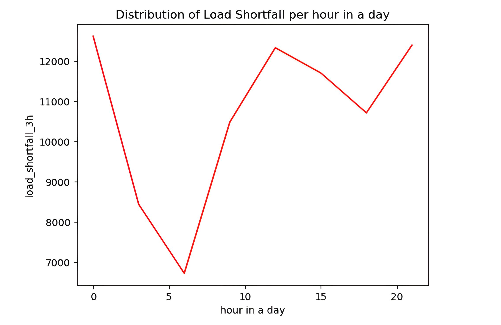
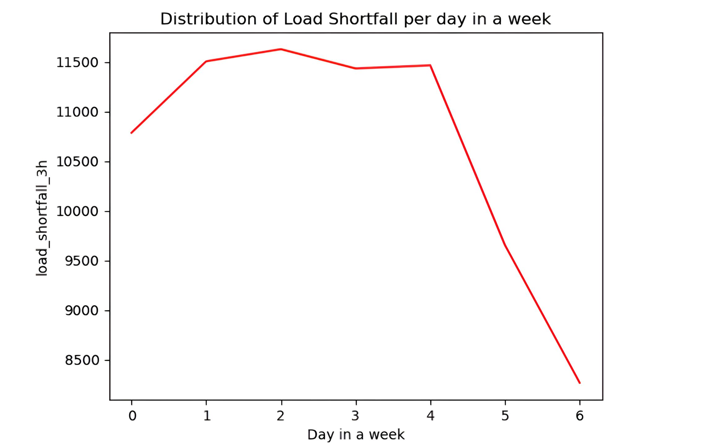
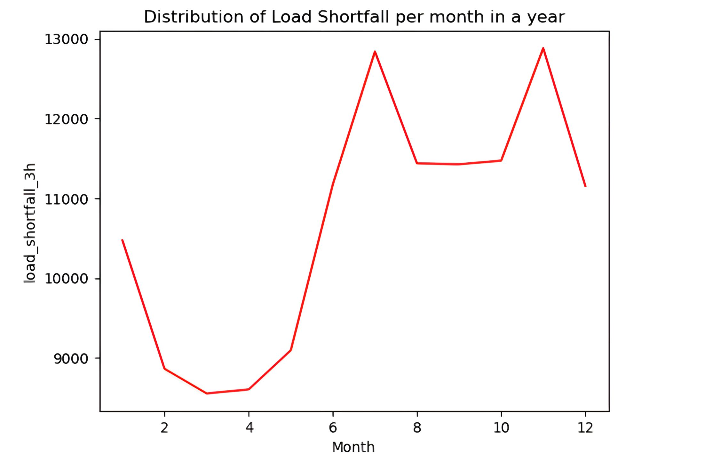

### Sustainable Energy Transformation

#### Introduction
In this project, I had the privilege of leading a dynamic team in a project of national significance – ensuring a sustainable electricity supply in Spain. Our mission was to bridge the gap between renewable and fossil fuel energy sources, using data-driven insights. Through thorough analysis and modeling, our team achieved the top position on the leaderboard, showcasing the power of data science in shaping a sustainable energy future. Our project emphasized the real-world impact of data-driven decisions and underscored the critical role of renewables in Spain's energy landscape. It was a journey of both professional growth and meaningful change.

#### Objective
Our primary objective was to model the daily shortfall between energy generated from fossil fuels and various renewable sources in Spain. This shortfall, referred to as the target variable, was predicted based on city-specific weather features such as pressure, wind speed, humidity, and more, in relation to energy consumption and production.

#### My Role

My contributions to this project include:

- Leading a dynamic team to bridge the gap between renewable and fossil fuel energy sources using data-driven insights.
- Overseeing in-depth data analysis and working closely with modeling, which led our team to achieve the top position on the leaderboard.
- Guiding the project to both professional growth and meaningful change.

#### Project Highlights

We conducted comprehensive analyses to uncover load shortfall patterns, identify causes, and select features for our machine learning model. Employing a strategic data analysis approach, we examined daily, weekly, monthly, seasonal, and yearly trends, revealing a significant daily shortfall.

Here are some project highlights and snapshots that showcase our work in action:

1. In figure I below, it is shown that there is a heavy load shortfall between 9 and 21 hours, coinciding with peak working hours. This highlights the potential of renewable energy to sustainably meet power demands during these critical periods:
- Fig 1
   
2. From figure II below, it is evident that load shortfalls are more pronounced on weekdays as opposed to weekends, indicating a substantial difference in energy consumption patterns between workdays and leisure days. This observation underscores the need for tailored energy solutions to meet the varying demands of both scenarios, with the potential for renewable energy sources to play a significant role in addressing these discrepancies and ensuring a consistent power supply across all days of the week:
- Fig 2
   
3. Figure III illustrates a higher frequency of shortfalls in the second half of the year compared to the first half, indicating a potential correlation with seasonal variations, particularly during the summer and winter months. This observation suggests that energy demand during the second half of the year may be influenced by factors such as increased cooling needs in the summer or higher heating demands in the winter:
- Fig 3
   

#### Recommendations

From the insights we uncovered, we were able to build a model that performs the best in predicting energy shortfall, through which we recommended that renewable energy sources should be adopted due to the following advantages:

**Environmental Sustainability**: Renewable energy sources, such as wind and solar power, have a significantly lower environmental impact compared to fossil fuels. They reduce greenhouse gas emissions and help combat climate change.

**Cost-Efficiency**: Over time, renewable energy systems can lead to reduced energy costs, making it a cost-effective choice in the long run.

**Energy Independence**: Relying on renewable energy sources reduces dependence on fossil fuel imports, increasing energy security.

**Job Creation**: The renewable energy sector generates jobs and contributes to economic growth.

**Reliability**: Renewable energy sources are more reliable in the long term, as they are not subject to the volatility of fossil fuel markets.

**Sustainable Growth**: Promoting renewable energy aligns with global efforts to achieve sustainable development goals and create a more sustainable and resilient energy future.

**Energy Access**: Expanding the use of renewable energy can provide energy access to remote and underserved areas.

Adopting renewable energy sources offers not only a solution to power shortages but also a pathway to a more sustainable and environmentally friendly energy landscape.

#### Conclusion
This project not only highlighted the importance of sustainable energy transformation but also demonstrated how data science can drive meaningful change. It was a privilege to lead a team in shaping the future of Spain's energy landscape through data-driven decisions.
